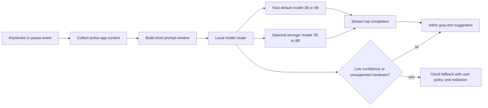

# Migrating Tab Inline Autocomplete from Cloud to Local Inference

## Executive summary

Migrating Tab from cloud inference to local inference is technically viable today for inline autocomplete across email, docs, Slack, and notes, but the right architecture depends heavily on the desktop tier you want to support. On current consumer laptops, the most practical local-first sweet spot is **small dense models in the 3B–8B range**, typically quantized to **4-bit or 8-bit** and run through **llama.cpp/GGUF**, **ONNX Runtime GenAI**, or **Apple-native Core ML / Metal** paths. Models in that range are small enough to fit on mainstream machines, broadly supported by local runtimes, and now competitive enough for short-form completion and rewriting tasks. Meta positions **Llama 3.2 1B/3B** as state of the art for on-device edge use cases; Microsoft’s **Phi-3.5 Mini 3.8B** is unusually strong for its size; Google’s **Gemma 4 edge models** and **Gemma 3 / 4 mid-size models** bring strong benchmark quality under Apache 2.0; and **Qwen2.5 7B** remains one of the strongest open-weight dense 7B-class models, especially for structured output and multilingual handling. citeturn19view3turn18search1turn20view1turn30view0

For a desktop autocomplete product, **latency dominates architecture choices more than absolute benchmark leadership**. Published local benchmarks show that modern open-weight models can already hit strong token throughput on commodity hardware: Apple reported **~33 tokens/s** for **Llama 3.1 8B Int4** on an **M1 Max** using Core ML and stateful KV cache; community benchmarks show **~71 tokens/s** for **Llama 2 7B Q4_0** on a native **M2 Max** with llama.cpp/Metal; Qwen’s official speed benchmarks on an **A100** show **Qwen2.5-3B-Instruct GPTQ-Int4** at **35.21 tokens/s** in Transformers and **168.20 tokens/s** in vLLM for short prompts, while **Qwen2.5-7B-Instruct GPTQ-Int4** reaches **43.10 tokens/s** in Transformers and **154.05 tokens/s** in vLLM in the same A100 setup. These numbers do not translate directly to laptop hardware, but they are strong evidence that 3B–8B local autocomplete is already practical on GPUs and Apple Silicon, while CPU-only devices need more aggressive model selection and prompt-budget discipline. citeturn13search0turn14view2turn29view0turn29view1

For Tab specifically, the best product strategy is usually **local-first with a tiered fallback**. A **minimal-effort path** uses **Ollama** with one small model and a localhost API. A **balanced path** embeds **llama.cpp** directly for lower overhead, tighter memory control, and better warm-start behavior. A **high-performance path** uses **per-platform runtimes**—**Core ML / Metal** on macOS, **ONNX Runtime GenAI + DirectML** on Windows, and either **llama.cpp CUDA/Vulkan** or a **Linux/NVIDIA path such as TensorRT-LLM or vLLM** where appropriate. The major trade-off is simple: the more turnkey the runtime, the more overhead and less tuning control you accept; the more native the integration, the better your latency and packaging story, but the more per-platform engineering you must own. citeturn41search4turn9search7turn10search8turn38search4turn7search18turn12search0turn11search1

Local inference materially improves privacy because keystroke-adjacent text never has to leave the device, but it does **not** eliminate security work. You still need to manage model provenance, sandboxing, local IPC, logs, crash dumps, and any local daemon you expose. Ollama explicitly positions itself around offline/local operation and keeping data local; Apple’s on-device Core ML guidance similarly emphasizes efficient on-device execution; ONNX Runtime GenAI is explicitly built for running LLMs on device. The privacy upside is real, but the operational burden shifts from vendor trust to local-software trust. citeturn41search9turn13search0turn38search4

## What matters most for inline autocomplete

Inline autocomplete is a very different workload from chat. It usually operates on **short, frequently refreshed prompts**, requires **fast time-to-first-token**, benefits from **stable warm-start behavior**, and often needs only **tens to a few hundreds of recent tokens** rather than the full 32K–256K context windows marketed on model cards. Using the entire nominal context window is usually counterproductive for latency and memory: Qwen’s own deployment docs warn that larger configured max lengths materially increase memory requirements in vLLM, and Meta’s model cards show that even their edge-oriented Llama 3.2 variants were evaluated across both standard tasks and long-context tasks separately, which maps well to the reality that autocomplete should optimize for the short-context path. citeturn27search6turn23view4

That makes a few engineering principles especially important. First, **small dense models beat larger sparse or reasoning-heavy models for default autocomplete**, even when bigger models look better on static benchmarks. Dense 3B–8B models are simpler to deploy, easier to quantize, and more predictable under bursty UI traffic. Second, **KV-cache behavior matters almost as much as raw decode speed**. Apple’s Core ML write-up on Llama 3.1 8B explicitly points to **stateful KV cache** as a core optimization for on-device decoding, and vLLM’s design centers on **PagedAttention** for KV-cache efficiency and **continuous batching** for serving throughput. Third, **cold starts matter**. Ollama documents explicit preload and `keep_alive` support so models can remain resident in memory, while llama.cpp defaults to **memory-mapped model loading**, which improves repeated start-up behavior at the cost of page-cache dependence. citeturn13search0turn27search1turn12search0turn9search7turn38search7

For Tab, the practical implication is that you should optimize for **warm resident models**, **small rolling contexts**, and **single-request latency** rather than headline batch throughput. A good local autocomplete design typically uses (a) a short recency window from the active editor, (b) light app-specific instructions, (c) optional semantic snippets from the current document or thread, and (d) a strict generation budget. That approach keeps prefill small enough that local models feel instantaneous on warm paths, especially on Apple Silicon and consumer NVIDIA laptops. The deployment architecture should look more like a **keystroke-sensitive scoring engine** than a general assistant. This is an engineering inference drawn from the benchmark and runtime behavior above. citeturn13search0turn14view2turn15view1turn15view2



## Model landscape

The strongest local candidates for Tab are not the oldest “open LLM” names, but the more recent **edge-optimized and medium-size open-weight families**. The table below focuses on models that are especially relevant for cross-app text completion on desktops.

| Model family | Best local size for Tab | Architecture and context | License | Quality proxy | Practical local fit | Quantization notes | Sources |
|---|---:|---|---|---|---|---|---|
| **Llama 3.2 Instruct** | **3B** | Dense autoregressive transformer with **GQA**; **128K** context; Meta explicitly targets on-device summarization, rewriting, and local edge use cases. | **Llama 3.2 Community License** | 3B Instruct: **MMLU 63.4**, **GSM8K 77.7**, **IFEval 77.4**. | Excellent “default model” candidate for laptops; wide ecosystem support. | Released in quantized/on-device variants; GGUF conversion and community quants are common. | citeturn22view1turn23view4turn36view2 |
| **Phi-3.5 Mini Instruct** | **3.8B** | Dense decoder-only transformer; **128K** context. | **MIT** | **GSM8K 86.2**, **HumanEval 62.8**, multilingual MMLU **55.4**; remarkably strong for size. | One of the best quality-per-GB options for CPU-friendly or thin-GPU laptops. | Commonly run in 4-bit/8-bit community quants; official page is BF16-first. | citeturn31view0turn31view1turn31view3turn36view4 |
| **Gemma 4** | **E4B** or **12B** | Dense and MoE variants; **128K–256K** context; text/image/audio family, but usable for text-only completion. | **Apache 2.0** | **E4B MMLU Pro 69.4**, **LiveCodeBench 52.0**; **12B MMLU Pro 77.2**, **LiveCodeBench 72.0**. | Strong current option if you want Apache licensing and a modern family. | Quantization depends on runtime; good fit for ONNX/Core ML/transformers ecosystems as support matures. | citeturn19view1turn20view1turn36view1 |
| **Gemma 3 IT** | **4B** | Dense family; model card reports changes to reduce **KV-cache memory**; **128K+** context. | Gemma terms apply; confirm exact commercial/legal fit per release page. | 4B IT: **MMLU Pro 43.6**, **HumanEval 71.3**, **GSM8K 89.2**. | Strong text quality for its class; worth testing against Phi and Llama 3.2. | Community 4-bit and 8-bit exports are common. | citeturn18search2turn20view0 |
| **Qwen2.5 Instruct** | **7B** | Dense decoder-only transformer with **RoPE, SwiGLU, RMSNorm, GQA**; **128K** context, though native config is often 32K before YaRN scaling. | **Apache 2.0** for 7B; note that some other Qwen2.5 sizes use different licenses. | 7B Instruct: **MMLU-Pro 56.3**, **GSM8K 91.6**, **HumanEval 84.8**, **Arena-Hard 52.0**. Base 7B MMLU **74.2**. | Strong all-arounder, especially for multilingual and structured generation. | Official docs publish **BF16 / GPTQ-Int8 / GPTQ-Int4 / AWQ** speed and memory tables. | citeturn26view0turn30view0turn36view3turn29view1 |
| **Llama 3.1 Instruct** | **8B** | Dense transformer with **GQA**; **128K** context. | **Llama 3.1 Community License** | 8B Instruct: **MMLU 69.4**, **MMLU-Pro 48.3**, **HumanEval 72.6**, **GSM8K 84.5**. | Still a very solid “quality-first” dense model, but heavier than 3B–4B defaults. | Good GGUF and Core ML coverage; Apple demonstrated Int4 on-device deployment. | citeturn22view2turn23view0turn23view1turn23view2turn13search0 |
| **Mixtral 8x7B** | **8x7B** | Sparse MoE; **~47B total / ~13B active**; **32K** context. | **Apache 2.0** | Mistral says it outperforms **Llama 2 70B** on most benchmarks and matches or beats GPT-3.5 on many standard benchmarks. | Great if you target workstation-class GPUs; usually too heavy for “every laptop” defaults. | MoE quantization works, but memory and runtime support are more complex. | citeturn34search0turn34search1 |
| **Code Llama** | **7B** | Code-specialized Llama 2 derivative; 7B/13B support **infilling**; trained at **16K**, can handle much longer inference sequences. | Custom Llama-family license | Meta reports up to **53% HumanEval** and **55% MBPP** across the family. | Useful if Tab later adds serious IDE or code-block completion, less compelling for general prose in 2026. | Community GGUF quants are abundant. | citeturn33search2turn33search13 |

A few older model families are still relevant mostly for **backward compatibility, research comparison, or niche use**, not as first-choice defaults for a new commercial desktop autocomplete product. **Mistral 7B** introduced **GQA** and **sliding-window attention**, and its original paper showed it beating Llama 2 13B across its reported benchmarks; however, Mistral’s current documentation marks the line as retired and replaced by newer edge models. **MPT-7B** remains notable for Apache 2.0 licensing and long-context work via **ALiBi**. **Falcon** has evolved away from the older Falcon 7B/40B story into newer families such as **Falcon 2**, **Falcon 3**, and hybrid **Falcon-H1** / **Falcon Mamba**, which explicitly target lower memory cost and more efficient long-context handling. **OpenLLaMA** and **Vicuna** were historically important, but they are now better treated as reference points than deployment targets. citeturn18search4turn32view1turn35search7turn39search1turn39search0turn39search4turn39search5turn40search0turn40search4

If Tab must ship one default model across the widest range of machines, the strongest short list is:

- **Llama 3.2 3B Instruct** for maximum ecosystem support and good on-device intent. citeturn19view3turn23view4
- **Phi-3.5 Mini Instruct** for exceptional quality-per-parameter. citeturn18search1turn31view3
- **Qwen2.5 7B Instruct** for users with stronger GPUs or Apple Silicon who can afford more memory and want stronger structured output and multilingual behavior. citeturn30view0turn29view1

## Benchmarks, latency, and hardware fit

Official benchmark numbers are useful, but for Tab you also need a grounded view of **desktop inference latency**. The tricky part is that vendor benchmark data is uneven: quality metrics are widely published, while desktop throughput numbers are often split between official A100/enterprise measurements and third-party/community laptop results. The best way to read the table below is as an **engineering range**, anchored in published measurements and then adjusted for common consumer hardware profiles. Where exact official numbers were not available for a given model/hardware pairing, the ranges are estimates and are labeled as such. citeturn29view0turn29view1turn14view2turn15view1turn15view2turn13search0

| Hardware profile | Small dense models 1B–4B | Medium dense models 7B–8B | Notes |
|---|---|---|---|
| **Intel i7 laptop CPU, 16 GB RAM, no dGPU** | **~12–40 tok/s** with aggressive 4-bit quantization and short contexts; best with 1B–3.8B models. | **~5–12 tok/s** is realistic for 7B-class 4-bit CPU-only paths; borderline for always-on autocomplete unless prompts are tiny. | On an older **i7-12700H**, a user-reported llama.cpp run improved from about **2.1 tok/s** to about **5 tok/s** by pinning to performance cores only for a 7B Q4 path, illustrating how thread placement matters on hybrid CPUs. Treat 7B CPU-only as a fallback, not the primary UX target. citeturn16search2 |
| **Apple M1 / M2 / M3 MacBook** | **~40–120+ tok/s** is realistic for 3B–4B class warm paths depending on chip and runtime. | **~30–70+ tok/s** is realistic for 7B–8B class models, especially with Metal / Core ML / MLX and warm KV cache. | Apple reported **~33 tok/s** for **Llama 3.1 8B Int4** on **M1 Max** via Core ML; community llama.cpp benchmarks show **~71 tok/s** for **Llama 2 7B Q4_0** on **M2 Max**; an M3 Max comparison reported **76.87 tok/s** for **Llama 3.2 3B 8-bit** in llama.cpp and **94.61 tok/s** in MLX. citeturn13search0turn14view2turn13search3 |
| **NVIDIA RTX 3060 / 4060 laptop GPU** | **~80–180+ tok/s** for 3B–4B class 4-bit paths is a reasonable estimate when fully GPU-resident. | **~55–90 tok/s** for 7B-class 4-bit is realistic. | Community llama.cpp scoreboards report **~75.6–76.9 tok/s** for **RTX 3060** on a Llama-2-7B-Q4 benchmark and **~59.5 tok/s** for **RTX 4060 Mobile** on Vulkan. Short-prompt prefill is even faster. Smaller 3B-class dense models should scale favorably from those 7B anchors. citeturn15view1turn15view2turn15view3 |

A few practical conclusions follow from those ranges. **CPU-only Windows laptops should default to 1B–4B models** and probably avoid 7B except as an opt-in “higher quality, slower” mode. **Apple Silicon is the best single-platform target** for local completion today because the integrated memory architecture, Metal stack, and maturing Core ML / MLX ecosystem make warm-start local inference feel much better than raw parameter counts suggest. **Consumer NVIDIA laptops are the easiest path to strong 7B local UX** on Windows/Linux, but runtime choice matters: CUDA backends are usually preferable; Vulkan is a strong fallback; DirectML is useful when you need simpler Windows packaging and broad device support. citeturn10search8turn7search18turn15view1turn15view2turn38search16

Cold-start behavior deserves its own note. **Model load time is often the biggest enemy of perceived responsiveness**. llama.cpp enables **memory mapping by default**, which improves repeated launches and avoids an extra full RAM copy; Ollama supports explicit **preloading** and **resident keep-alive**; and repeated warm invocations on Apple’s Core ML path benefit heavily from **stateful KV cache** reuse. In practice, on NVMe SSDs, you should expect something like **sub-second to a couple of seconds** for the smallest quantized models, **a few seconds** for 7B–8B class quants, and longer for larger BF16 or multimodal bundles. That is an estimate, but it is consistent with the published behavior of mmap/preload and the file sizes implied by the quantized footprints above. citeturn38search7turn9search1turn9search7turn13search0

## Runtimes and toolchains

The runtime decision matters almost as much as the model choice. For Tab, there are really three categories: **embedded local runtimes**, **local daemon/server runtimes**, and **GPU-optimized serving stacks**.

| Toolchain | Best use in Tab | Strengths | Weaknesses | OS / packaging / licensing | Sources |
|---|---|---|---|---|---|
| **llama.cpp + GGUF/GGML** | Best general-purpose embedded runtime for local desktop apps. | Lightweight C/C++; broad backend support including CPU, Metal, CUDA, Vulkan, OpenCL, OpenVINO, SYCL; mmap by default; strong GGUF ecosystem; OpenAI-compatible server; continuous batching support in server. | You own native integration and model conversion; less turnkey than Ollama. | Cross-platform; GGUF is optimized for fast load and inference; MIT license in repo. | citeturn10search0turn10search2turn10search8turn8search0turn38search7 |
| **Ollama** | Fastest path to shipping a localhost prototype. | Runs on macOS, Windows, Linux; easy model pulls; keep-alive/preload support; simple API; privacy/offline positioning. | Additional daemon layer; fewer low-level controls than direct embedding; less ideal if you need very tight UI-process coupling. | macOS, Windows, Linux; native app/CLI packaging; Apache 2.0 repo plus model licenses vary. | citeturn41search4turn41search0turn41search7turn41search8turn9search7turn41search9 |
| **ONNX Runtime GenAI** | Strong Windows-first option; also useful for cross-platform shipping with model conversion. | On-device LLM loop includes KV-cache handling, search/sampling, grammar/tool calling; good execution-provider story. | Requires ONNX export/build pipeline; model support is less plug-and-play than GGUF ecosystems. | Cross-platform ONNX Runtime; DirectML on Windows; Core ML EP on Apple. MIT license. | citeturn38search4turn38search16turn7search18 |
| **Core ML / Metal** | Best pure macOS path for premium Apple Silicon UX. | Excellent Apple hardware utilization; official demonstration of high on-device throughput with Int4 + stateful KV cache. | Apple-only; conversion pipeline adds maintenance; model support depends on conversion maturity. | macOS-focused native packaging through Core ML. | citeturn13search0turn7search18 |
| **vLLM** | Best for Linux GPU workstations or internal local gateway, not end-user desktop default. | PagedAttention, continuous batching, optimized kernels, very high serving throughput. | Full runtime support is Linux-first; native Windows unsupported, macOS support is experimental/build-from-source for CPU. | Linux primary; NVIDIA/ROCm/XPU/CPU variants; Apache 2.0. | citeturn12search0turn12search10turn12search13turn27search1 |
| **TensorRT-LLM / FasterTransformer** | Maximum-performance NVIDIA path for specialized deployments. | Deep CUDA/TensorRT optimizations; INT8/FP8/NVFP4 options; production-serving focus. | Too heavy for broad desktop distribution; Windows support has been in flux/deprecated in newer releases. | NVIDIA-centric; production/server bias. | citeturn11search1turn11search2turn11search17turn11search20 |
| **MLC-LLM / WebLLM** | Useful if Tab wants portable native or browser/webview inference. | Universal deployment focus; native and WebGPU/browser options; OpenAI-compatible browser runtime via WebLLM. | Less mainstream for desktop Electron app teams than llama.cpp or Ollama; debugging can be more specialized. | Runs across native devices and WebGPU/Web; Apache 2.0. | citeturn38search1turn38search5 |
| **Transformers + bitsandbytes** | Good research/prototyping path; less ideal for polished desktop distribution. | Easiest Python path to 4-bit and 8-bit experimentation. | Heavy Python stack; packaging pain for consumer desktop. | Python-centric; bitsandbytes supports 4-bit and 8-bit ops. | citeturn38search0turn38search2turn38search14 |
| **DirectML** | Good Windows accelerator path under ONNX Runtime when CUDA is unavailable or undesirable. | Broad Windows GPU coverage through ONNX Runtime EP. | Generally below vendor-specific CUDA performance ceilings. | Windows-focused via ONNX Runtime. | citeturn7search19turn38search16 |
| **WebGPU / WASM** | Good for extension/webview prototypes, not primary desktop inferencing for larger models. | Sandboxed, distribution-friendly, zero native installer in browser contexts. | Model size, cache behavior, download UX, and GPU variability are major constraints. | Browser/WebGPU path through WebLLM and similar stacks. | citeturn38search5 |

Two practical recommendations stand out. First, **do not start with vLLM as the client runtime** for Tab itself unless you are deliberately building a local gateway for power users on Linux/NVIDIA. Its strengths are continuous batching and throughput under multi-request load, not lowest-complexity desktop embedding. Second, **do not optimize around obsolete GGML/GGMLv3-era formats**. Modern llama.cpp expects **GGUF**, which was designed for fast loading and broad inference compatibility. If you use the llama.cpp family, standardize on **GGUF** and ignore older file-format advice. citeturn12search0turn10search0turn10search2

## Deployment architecture and optimization

For Tab, the best local architecture is usually **local-first, model-resident, and latency-budgeted**. Keep one model loaded, use short prompts, stream immediately, and only escalate when necessary. The following practices have the highest payoff.

**Use weight-only quantization first.** In practice, most desktop deployments should begin with **4-bit** for 3B–8B models, then move to **8-bit** or **FP16/BF16** only on higher-end machines where the quality delta is worth the memory cost. Qwen’s official speed pages show a clear memory reduction from BF16 to GPTQ-Int4 and often equal or better short-prompt throughput for 3B and 7B models; bitsandbytes explicitly supports **4-bit** and **8-bit** quantization; llama.cpp’s quantization tool is built around converting higher-precision GGUF weights into lower-bit formats, with perplexity/KL trade-offs documented. citeturn29view0turn29view1turn38search2turn10search16

**Keep the model warm.** Ollama supports empty-request preloading and explicit `keep_alive`; llama.cpp supports memory mapping and `mlock`; Apple’s Core ML path benefits from stateful KV cache. For an autocomplete product, this means the model should typically be loaded at app startup or first invoke, then kept resident during active work sessions. Warm-start optimization usually matters more to user-perceived quality than chasing one more benchmark point. citeturn9search1turn9search7turn38search7turn13search0

**Cap prompt budgets aggressively.** Even if your chosen model supports 128K or 256K context, autocomplete almost never needs it. Prefer a rolling window of recent text plus a small number of app- or document-aware hints. Long-context support is still useful for optional document-aware modes, but it should not be on the hot path. Qwen’s docs explicitly warn that larger configured max positions increase memory requirements; Mistral’s original 7B paper shows how **sliding-window attention** can reduce inference cost for long sequences; and Gemma 3’s technical report highlights explicit architectural work to reduce KV-cache growth. citeturn27search6turn18search4turn18search2

**Route by confidence and hardware tier.** A practical Tab deployment can use a fast 3B–4B model as the default and only escalate to a stronger 7B–8B model—or to cloud—when confidence is low or when the user requests a longer rewrite. Confidence can be approximated from token logprobs where supported; Ollama’s API exposes logprobs, and similar signals are available in other local runtimes. That gives you a principled hybrid path instead of silently overusing cloud. citeturn9search3

The following snippets capture the most practical integration starting points.

```bash
# llama.cpp: run a GGUF model locally with a short context and GPU offload
llama-server \
  -m ./models/Llama-3.2-3B-Instruct-Q4_K_M.gguf \
  -c 2048 \
  -ngl 99 \
  --cont-batching \
  --mmap

# quantize an f16/bf16 GGUF down to a smaller format
llama-quantize \
  ./models/model-f16.gguf \
  ./models/model-q4_k_m.gguf \
  Q4_K_M
```

The llama.cpp CLI and server expose explicit controls for **threads**, **threads-batch**, **continuous batching**, and **memory mapping**, which is exactly the kind of control surface you want in a latency-sensitive desktop product. citeturn8search3turn8search0turn10search16turn38search7

```bash
# Ollama: preload and keep a model resident for warm autocomplete
curl http://localhost:11434/api/generate -d '{
  "model": "llama3.2",
  "keep_alive": -1
}'
```

Ollama also supports `keep_alive: 0` to unload immediately, which is useful if you want to reclaim VRAM on laptops when Tab is idle. citeturn9search0turn9search1

```python
# ONNX Runtime GenAI: sketch of an on-device generation session
import onnxruntime_genai as og

model = og.Model("models/phi3-mini-int4-cuda")
tokenizer = og.Tokenizer(model)
params = og.GeneratorParams(model)
params.set_search_options(max_length=64)

prompt = "Finish this sentence naturally:\nI wanted to follow up on"
tokens = tokenizer.encode(prompt)

generator = og.Generator(model, params)
generator.append_tokens(tokens)

while not generator.is_done():
    generator.generate_next_token()
    token = generator.get_next_tokens()[0]
    print(tokenizer.decode([token]), end="", flush=True)
```

ONNX Runtime GenAI is appealing here because it owns the **generation loop**, **KV-cache**, and **sampling** directly, which keeps your app-level integration relatively clean. citeturn38search4turn38search12

```python
# Transformers + bitsandbytes: rapid 4-bit prototype
from transformers import AutoModelForCausalLM, AutoTokenizer, BitsAndBytesConfig

model_id = "microsoft/Phi-3.5-mini-instruct"
bnb = BitsAndBytesConfig(load_in_4bit=True)

tok = AutoTokenizer.from_pretrained(model_id)
model = AutoModelForCausalLM.from_pretrained(
    model_id,
    quantization_config=bnb,
    device_map="auto"
)
```

This is excellent for research and evaluation, but usually not the final desktop packaging path. citeturn38search0turn38search2

## Recommended paths for Tab

**Minimal-effort path: Ollama + one fast default model.**
Use **Ollama** as the local daemon, start with **Llama 3.2 3B** or **Phi-3.5 Mini**, keep the model resident, and call the local API from Tab with a short rolling prompt. This is the fastest route to a working prototype across **macOS, Windows, and Linux**. The engineering tasks are straightforward: bundle a model selection UX, detect machine tier, preload the chosen model, define a prompt format per app type, and add a local/cloud policy layer. Resource-wise, assume **~2–6 GB** resident weight footprint for a 3B–4B 4-bit class model plus runtime overhead, with meaningfully better UX on Apple Silicon and dGPU laptops than on CPU-only Windows laptops. The trade-off is extra localhost-daemon overhead and less precise control over memory, threading, and scheduling. citeturn41search4turn9search7turn19view3turn18search1

**Balanced path: embed llama.cpp directly.**
This is the most generally attractive architecture if Tab is a serious product rather than a demo. Standardize on **GGUF**, ship **one default 3B–4B model** and optionally **one 7B–8B “quality” model**, and integrate llama.cpp directly into the app or into a tightly controlled helper process. Use **Metal** on macOS, **CUDA** where available on NVIDIA, **Vulkan** as a broader fallback, and CPU as last resort. Implement **warm residency**, **small contexts**, **streaming on the first token**, and an optional **confidence-based cloud fallback**. Expect materially lower overhead than Ollama, better cold/warm behavior control, and easier packaging of model policies, at the cost of more native build engineering. For a biased recommendation: if Tab wants one serious local stack that can survive contact with real users, this is the best default choice. citeturn10search0turn10search8turn8search0turn38search7

**High-performance path: per-platform optimized runtimes.**
If you want the best possible local UX on each OS, split the inference path by platform. On **macOS**, use **Core ML / Metal** for your default shipping path. On **Windows**, use **ONNX Runtime GenAI + DirectML** as the general path and optionally a **CUDA** path for NVIDIA GPUs. On **Linux/NVIDIA**, use either **llama.cpp CUDA** for embedded simplicity or **vLLM / TensorRT-LLM** for a separate local serving process on high-end machines. Then add a **two-stage model policy**: a small default model for hot keystroke completions and a stronger model for rewrite or expansion actions. This path maximizes performance and product polish, but it also creates the largest maintenance surface, because you now own multiple model formats, conversion pipelines, and backend-specific regressions. citeturn13search0turn38search4turn7search18turn12search0turn11search1

Across all three paths, the same policy guidance applies. Start with **4-bit quantization**, keep contexts small, maintain warm models, cache session state aggressively, and make cloud fallback **explicit and policy-driven**. Use a **local-first trust model** for sensitive apps like email and docs, and only allow cloud fallback where user policy permits it. If you later expand into IDE-grade code completion, add a second model track—**Code Llama** or a stronger code model—rather than burdening the prose-autocomplete path with a heavier general model. citeturn10search16turn9search0turn33search2
